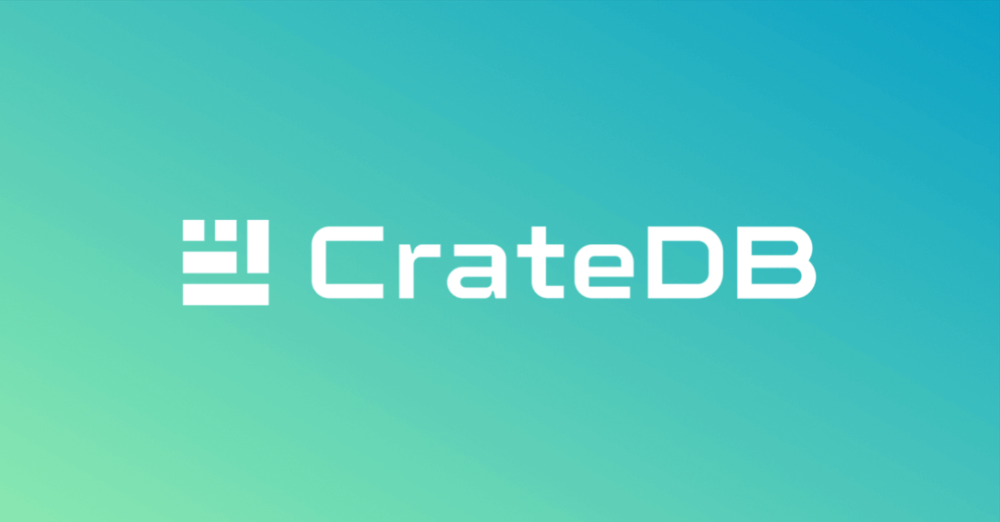

# Integrando Api com Um banco de dados distribuido



## CrateDB
CrateDB é a implementação de um fork do famoso projeto [Elasticsearch](https://www.elastic.co/pt/elasticsearch), uma ferramenta escrita em java que tem como objetivo fornecer alta performance em análise de dados e buscas em massa, nesta implementação CrateDb fornece um banco de dados distribuído de alta performance, capaz de transitar entre dados relacionais até dados geoespaciais, isso utilizando o protocolo implementado pelo [PostgreSQL](https://www.postgresql.org/).

## Objetivo
Integrar uma API escrita em .net framework com um cluster CrateDB formado com 3 containers docker ( objetivo com os containeres é simular maquinas diferentes ) e demonstrar o comportamento do banco de dados.

## Configurações

### *Esse projeto foi desenvolvido usando linux, distro [Ubuntu](https://ubuntu.com/), versão 22.04 LTS*

Utilizando docker buscamos pela [imagem oficial](https://hub.docker.com/_/crate) da tecnologia


Para configurar as instâncias/containeres crate vamos injetar as configurações direto no container, sibtituindo as configurações padrões

### Config Template
```yml
cluster.name: cratecluster
# Tag que define se é o container mestre ou não
node.master: true
node.data: true
# Porta para interface Web ( AdminUI )
http.port: 4200
# Porta para conectar diretamente com o banco de dados
psql.port: 5432
# Porta de conexão e comunicação entre os containeres
transport.tcp.port: 4300
http.cors.enabled: true
http.cors.allow-origin: "*"
gateway.expected_nodes: 3
gateway.recover_after_nodes: 2
gateway.recover_after_time: 5m
network.host: _local_,_site_
path.logs: /data/log
path.data: /data/data
blobs.path: /data/blobs
# Se não é o node master, passar o caminho de descoberta do mesmo
discovery.seed_hosts:
  - crate1:4300
```

### Docker compose
Vamos subir um docker compose que contem 3 instancias/containeres de uma aplicação crate, juntamente, injetaremos nossas configurações no caminho padrão dentro do container e faremos um bind mount para assim persistir os dados dos apps.

```yml
version: '3'

services:
  crate1:
    image: crate
    container_name: crate1
    volumes:
    - ./data1:/data
    - ./config/master.yml:/crate/config/crate.yml
    ports:
    - "4200:4200"
    - "4300:4300"
    - "5432:5432"

  crate2:
    image: crate
    container_name: crate2
    volumes:
    - ./data2:/data
    - ./config/node.yml:/crate/config/crate.yml
    ports:
    - "4201:4200"
    - "4301:4300"
    - "5433:5432"

  crate3:
    image: crate
    container_name: crate3
    volumes:
    - "./data3:/data"
    - "./config/node.yml:/crate/config/crate.yml"
    ports:
    - "4202:4200"
    - "4302:4300"
    - "5434:5432"
  


networks:
  crateDB:
    external: true
```

## Subindo a aplicação

comming...